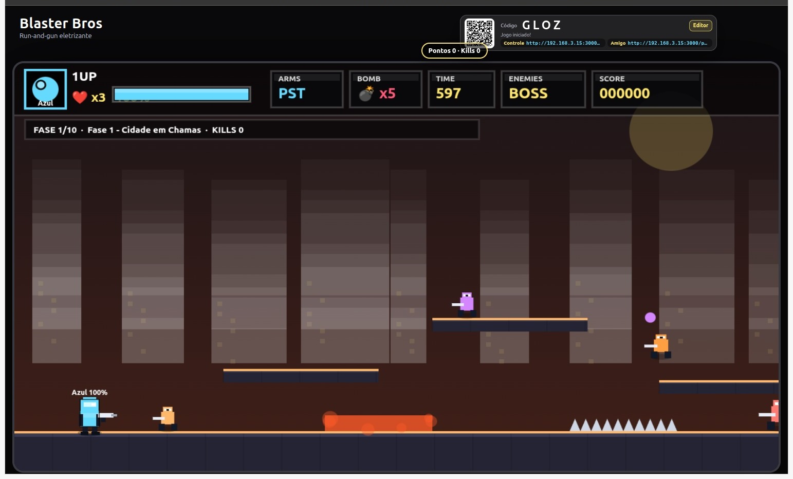
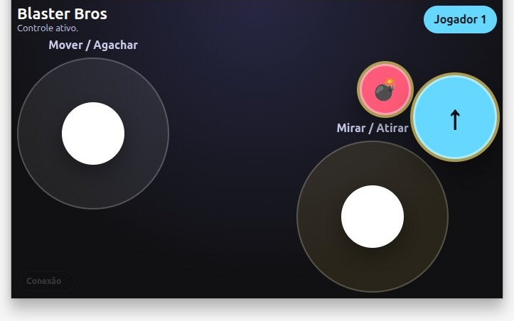
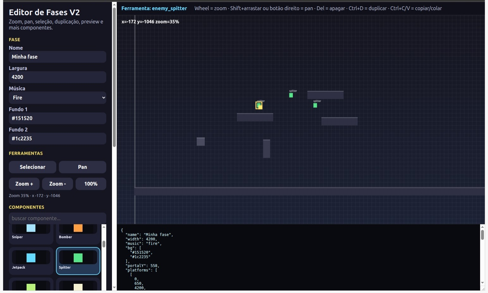

# Blaster Bros

Blaster Bros é um jogo web de plataforma no estilo run-and-gun, com tela principal para TV/navegador, controles por celular e suporte a partidas com até 4 jogadores.

O projeto também funciona como uma pequena engine para criar fases, testar componentes e renderizar a mesma sessão em clientes remotos.

## Telas

### Jogo



### Controle



### Editor



## Recursos

- Jogo de plataforma 2D com ação run-and-gun.
- Tela host para TV ou navegador principal.
- Controle mobile conectado por QR Code ou código da sala.
- Multiplayer com até 4 jogadores.
- Viewer remoto para amigos acompanharem ou jogarem pela mesma sessão.
- Renderização compartilhada por estado entre TV e viewers.
- Editor visual de fases com drag-and-drop.
- Catálogo de plataformas, inimigos, chefes, armas, pickups, hazards, decoração e portal.
- Exportação e importação de fases em JSON.
- Suporte a execução local, rede local, VPS, VPN ou domínio público.

## Como rodar

Instale as dependências e inicie o servidor:

```bash
npm install
npm start
```

Por padrão, o servidor roda em:

```txt
http://localhost:3000
```

Para jogar na rede local, abra a URL pelo IP da máquina que está rodando o servidor:

```txt
http://SEU-IP:3000
```

## Entradas

- TV / host: `/` ou `/tv`
- Controle mobile: `/controller.html`
- Viewer / amigo: `/viewer.html`, `/play` ou `/spectator`
- Editor de fases: `/editor.html`

## Como jogar

Na tela da TV, o jogo cria uma sala com QR Code, código e links de convite. Cada jogador abre o controle no celular e entra na mesma sala.

No controle mobile:

- Analógico esquerdo: movimentação
- Botão de pulo: pular
- Analógico direito: mirar e atirar
- Botão de granada: lançar granada

## Editor de fases

O editor permite montar fases visualmente, posicionando plataformas, inimigos, perigos, pickups, armas, decoração e portal.

Principais ações:

- arrastar objetos no cenário
- redimensionar plataformas e hazards
- selecionar, apagar, duplicar, copiar e colar componentes
- aplicar zoom e pan no mapa
- exportar e importar JSON
- testar a fase diretamente no jogo

Para abrir:

```txt
http://localhost:3000/editor.html
```

## Hospedagem pública

Para jogar com pessoas em redes diferentes, todos precisam acessar a mesma URL pública da sessão. Em VPS, VPN ou domínio público, configure `PUBLIC_URL` para que o QR Code e os links apontem para o endereço correto.

Exemplo com domínio:

```bash
PUBLIC_URL=https://jogo.seudominio.com npm start
```

Exemplo com IP público:

```bash
PUBLIC_URL=http://IP-DA-VPS:3000 npm start
```

Se usar uma VPS, libere a porta do servidor:

```bash
sudo ufw allow 3000/tcp
```

## Estrutura

```text
server.js
public/
  index.html
  controller.html
  viewer.html
  editor.html
  assets/
    css/
    js/
      engine/
      game/
      controller/
      editor/
      viewer/
      config/
    sprites/
    audio/
docs/
src/
engine.manifest.json
```

## Scripts

```bash
npm start
npm run dev
npm run check
```

## Documentação

- [Arquitetura](docs/ARCHITECTURE.md)
- [Guia do editor](docs/EDITOR_GUIDE.md)
- [Extensão da engine](docs/EXTENDING_ENGINE.md)
- [Latência](docs/LATENCY.md)
- [Manifesto da engine](engine.manifest.json)
